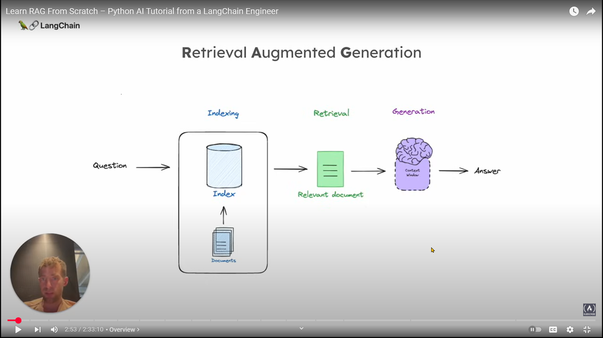

# About
This repository contains code and notes taken from [free course at freeCodeCamp](https://www.youtube.com/watch?v=sVcwVQRHIc8) by [Lance Martin from LangChain](https://x.com/RLanceMartin)

# Notes

1. [Welcome Mixtral - a SOTA Mixture of Experts on Hugging Face](https://huggingface.co/blog/mixtral)
2. [A must-read interview for investors investing in the AI space ... from Rihard Jarc at X.com](https://x.com/rihardjarc/status/1778082161595208124)
3. [A more complete picture is emerging of LLMs not as a chatbot, but the kernel process of a new Operating System ... from Andrej Karpathy at X.com ](https://x.com/karpathy/status/1707437820045062561)
4. RAG: Retrieval Augmented Generation

5. Course outline:
   1. Basics
      1. Indexing
      2. Retrieval
      3. Generation
   2. Advanced
      1. Query transformations
      2. Routing
      3. Query construction
      4. Indexing
      5. Retrieval
      6. Generation